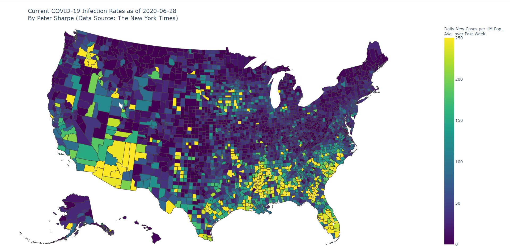

# [COVID-19 Hotspots](https://peterdsharpe.github.io/covid-hotspots/)

by Peter Sharpe

## Overview

An interactive map of where in the United States the average person is currently most likely to contract COVID-19.

Available at:
https://peterdsharpe.github.io/covid-hotspots/

Example map:

## Data Source

[New York Times COVID-19 dataset](https://github.com/nytimes/covid-19-data).
